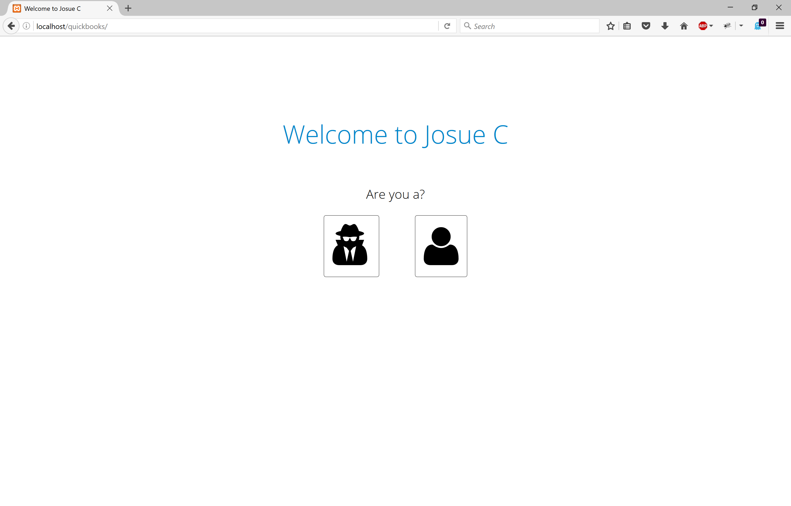

# XeroQuickbooksPHP
This is a web app connected to a database, it can be installed in any company server and store user's xero and quickbooks invoices and more. You can complement this with the desktop application I developed

## Requirements
* PHP 5+
* php\_curl extension - ensure a recent version (7.30+)
* php\_openssl extension
* Install Oauth php Library in your server [Oauth installation guide Link](http://php.net/manual/en/book.oauth.php), [Oauth php source code Link](http://pecl.php.net/package/oauth)

## Instalation

### Very Important
* Extract it into your root path.
* We meed a developer account for accessing to both, quickbooks and xero (production or development keys).
* Change quickbooks credentials in ../init/src/config.php.
* Change xero credentials in ../init/src/api/xero-sdk/config.php.
* Change extension_root in javascript.

### Setup database
* Just run the php file /init/index.php
* To do this you must give database credentials DB_USER and DB_PASS
* Change database credentials DB_USER and DB_PASS in ../init/src/JC/database/config.php.
* To modify database table contants you can do it in ../init/src/JC/database/contatants.php.

### Extras
* To modify html layout you need to modify ../init/pages/nameOfFileYouWannaChange.php pick any name of file you wanna change
* To modify css style just change ../init/src/css/styles.css file

### Bugs
* Stores 3 times xero credential of costumer.

## License & Credits

This software is published under the [MIT License](http://en.wikipedia.org/wiki/MIT_License).

###### OAuthSimple
OAuthsimple.php contains minor adaptations from the OAuthSimple PHP class by [United Heroes](http://unitedheroes.net/OAuthSimple/).

###### tmhOAuth
XeroOAuth class is based on code and structure derived from the [tmhOAuth](https://github.com/themattharris/tmhOAuth) library.

##Screenshot Demo

###### Welcome Page

